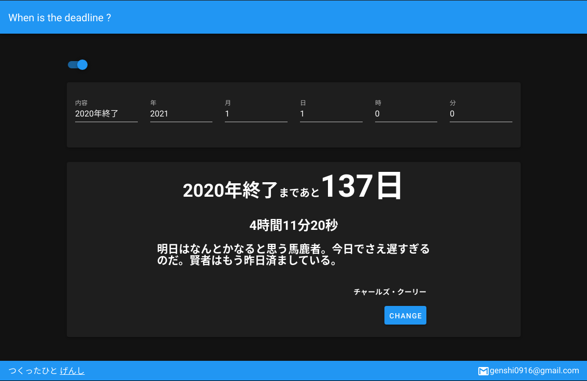

# when_is_the_deadline
 
よくTwitterなどで見かけるタイマーを作りました

url : [https://genshi0916.github.io/when_is_the_deadline/#/](https://genshi0916.github.io/when_is_the_deadline/#/)
 
# DEMO
 
締切の内容と締め切りの日時を上のフォームに入力するだけで使うことができます
 
CHANGEボタンをクリックすると下に表示されている名言を変更することができます


 
# Requirement
 
* vue
* vuetify
 
# Installation
 

 
```bash
$ npm install -g @vue/cli
$ npm install vuetify
```
 
# Usage

```bash
$ npm run serve
```
# Hosting

This page is hosted by GitHub Pages.
